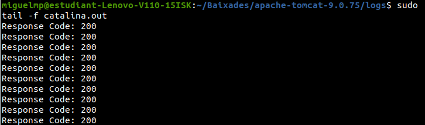
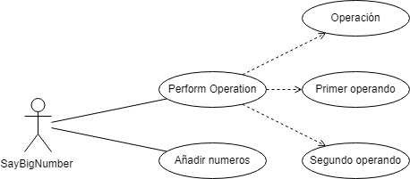
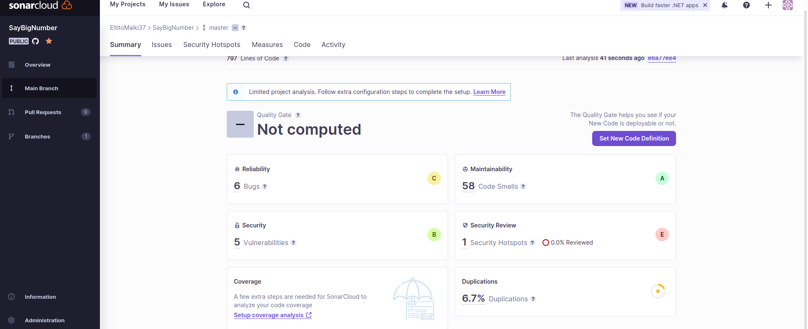
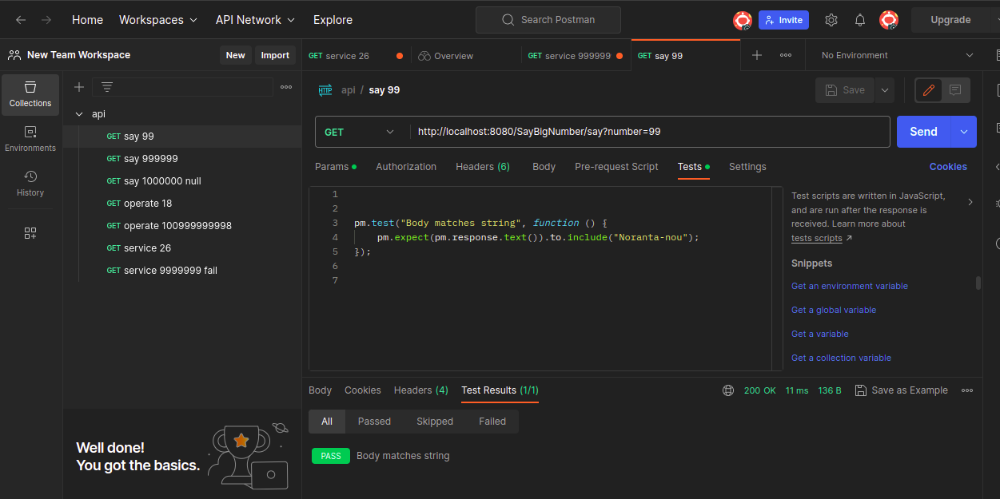
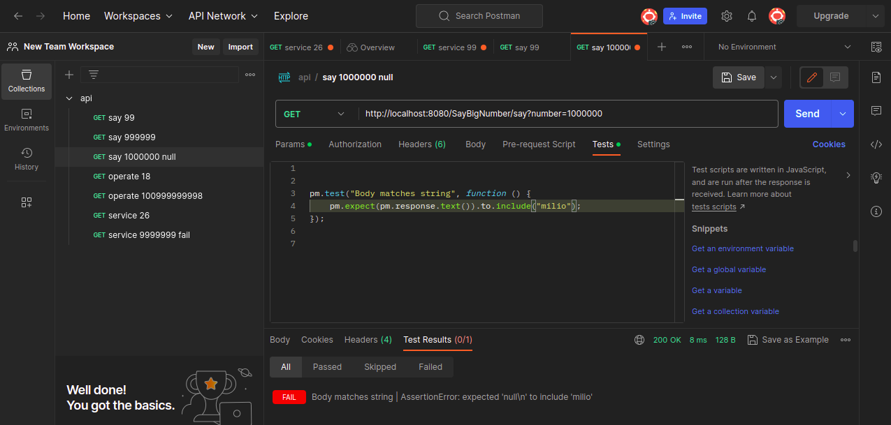

# Say Big Numbers

Permite convertir números en su representación textual y realizar operaciones matemáticas con números grandes.

## Configuración del entorno local

Para configurar el entorno local, sigue los siguientes pasos:

1. Instala **Apache Tomcat 9** siguiendo las instrucciones en [https://tomcat.apache.org/download-90.cgi](https://tomcat.apache.org/download-90.cgi).
2. Verifica que puedas iniciar **Apache Tomcat** localmente. Por defecto, se ejecuta en el puerto 8080. Puedes acceder a la página de administración en [http://localhost:8080/manager/html](http://localhost:8080/manager/html).

## Configuración de la webapp

1. Descarga el proyecto `SayBigNumber.zip`.
2. Descomprime el archivo ZIP y ábrelo en **IntelliJ** o tu IDE preferido.
3. En el proyecto, agrega la clase `NumbersCat` y haz que implemente la interfaz `Numbers`.
4. Agrega la clase `BigNumber` al proyecto y haz que implemente la interfaz `BigNumberOperator`.
5. Modifica la clase `SayBigNumberFactory` para utilizar tus objetos implementados.
6. Si tienes asignado un servidor en **Es Liceu**, el profesor te proporcionará un endpoint. Configura este endpoint en la clase `SayBigNumberFactory` (por defecto, está configurado para apuntar a la instancia local).

## Servicios de la webapp

La webapp ofrece los siguientes servicios:

- `say`: Convierte un número en su representación textual. Ejemplo de uso: [http://localhost:8080/SayBigNumber/say?number=71](http://localhost:8080/SayBigNumber/say?number=71)
- `operate`: Realiza una operación matemática con dos números. Ejemplo de uso: [http://localhost:8080/SayBigNumber/operate?operation=add&number1=13&number2=57](http://localhost:8080/SayBigNumber/operate?operation=add&number1=13&number2=57)
- `service`: Realiza una operación matemática con dos números y devuelve el resultado en formato JSON. Ejemplo de uso: [http://localhost:8080/SayBigNumber/service?operation=add&number1=13&number2=5](http://localhost:8080/SayBigNumber/service?operation=add&number1=13&number2=5)

## Comprobación de los logs

La salida de la aplicación se encuentra en `<TOMCAT_HOME>/logs/catalina.out`. Puedes usar la herramienta `tail` para ver los logs en la pantalla:

```bash
<TOMCAT_HOME>/logs $ tail -f catalina.out 
```




## Diagramas
A continuación, se muestran los diagramas UML necesarios para comprender el funcionamiento del proyecto:

- Diagrama de comunicación


- Diagrama de casos de uso


- Diagrama de secuencia


- Diagrama de flujo


- Diagrama de clases


## Pipeline

La construcción del proyecto debe seguir una pipeline que incluya las siguientes etapas:

1. **Build**: El código tiene una clase llamada BigNumber que sirve para trabajar con números. Esta clase puede hacer operaciones matemáticas como sumar, restar, multiplicar.

El código maneja los números como cadenas de texto y se encarga de eliminar los ceros innecesarios al principio de los números. No hay límites específicos establecidos en el código.

2. **Unit tests**: El código es una especie de prueba para una clase llamada BigNumber. Esta clase parece ser una manera de trabajar con números muy grandes que son más grandes de lo que los tipos de datos normales pueden manejar. La prueba unitaria comprueba diferentes aspectos de la clase BigNumber, como comparaciones, sumas y multiplicaciones.

- El método comparaciones() verifica si diferentes instancias de BigNumber son iguales, mayores o menores usando el método compareTo().
- El método sumas() verifica la suma de diferentes instancias de BigNumber usando el método add(), y comprueba si el resultado es el esperado.

3. **SonarQube**: Análisis estático del código para identificar posibles problemas y mejorar la calidad del código. 

4. **Deploy**: Asegúrate de que la práctica esté completa y que pase los tests en IntelliJ. Esto implica que has implementado todas las funcionalidades requeridas y que los tests unitarios asociados a la práctica se ejecutan correctamente en el entorno de desarrollo.

Abre el archivo "saybinumbersfactory" en tu editor de código y realiza las modificaciones necesarias para que pueda obtener las prácticas relacionadas con big numbers y numbers cat. 

Descarga Apache Maven desde el sitio web oficial de Apache Maven [https://maven.apache.org](https://maven.apache.org) siguiendo las instrucciones correspondientes a tu sistema operativo. Esto generalmente implica descargar el archivo binario de Maven y descomprimirlo en una ubicación deseada en tu computadora.

Configura las variables de entorno del sistema para que apunten al directorio de Maven descomprimido. Asegúrate de agregar la ruta al ejecutable de Maven (generalmente llamado "mvn") a la variable PATH. Esto permitirá que puedas ejecutar comandos de Maven desde cualquier ubicación en la línea de comandos.

Una vez que hayas terminado de editar el código y Maven esté correctamente configurado, realiza el empaquetado del proyecto utilizando Maven:

1. Abre una terminal o línea de comandos en el directorio raíz de tu proyecto, donde se encuentra el archivo "pom.xml".
2. Ejecuta el comando `mvn package`. Esto iniciará el proceso de empaquetado definido en el archivo "pom.xml".
3. Maven compilará tu proyecto, ejecutará los tests, generará los archivos de distribución y construirá el archivo WAR para tu proyecto.
4. Una vez que el comando se haya completado sin errores, encontrarás el archivo WAR en el directorio "target" de tu proyecto.

Copia el archivo WAR generado y pégalo en la carpeta "webapps" del directorio de instalación de Apache Tomcat.

Reinicia el servidor Tomcat para que cargue y despliegue tu aplicación. Una vez que Tomcat se haya reiniciado ya estará disponible

5. **API tests**: Ejecución de pruebas automatizadas para verificar el funcionamiento de los servicios de la webapp.

6. **E2E tests**: Ejecución de pruebas de extremo a extremo para verificar la funcionalidad completa de la webapp. Como se puede ver hasta donde es capaz de llegar nuestro codigo en temas de funcionalidad.



